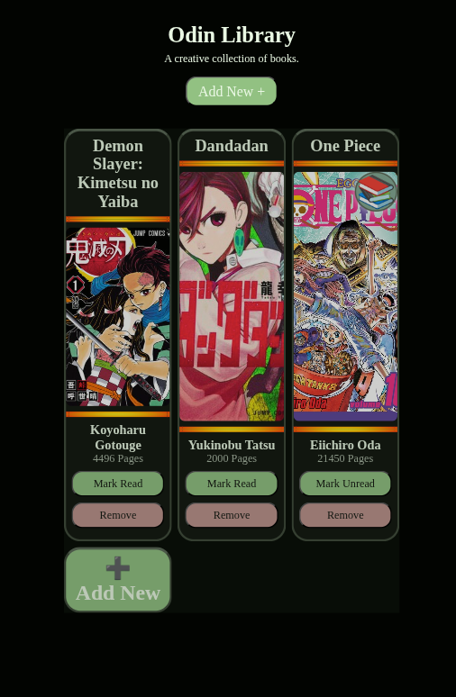
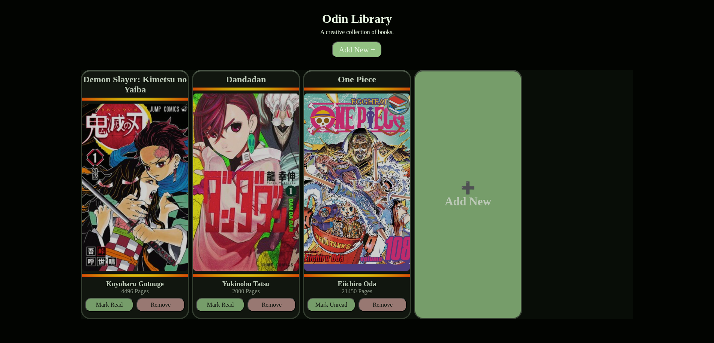

# 📚 Library App

A small JavaScript-powered Library app that allows users to add, view, and manage a list of books. This project is built using **HTML**, **CSS**, and **JavaScript**, with a focus on applying the **Object pattern** to manage book data and interactions.

---

## 🧠 Project Description

The goal of this project is to practice fundamental JavaScript concepts like:

- Object constructors / factory functions
- DOM manipulation
- Event handling
- Array and object usage for data management

The app allows users to:
- Add new books
- Display them dynamically on the page
- Toggle read status
- Remove books from the library

---

## 🎯 Key Objectives

- Use objects to represent book entries
- Practice modular code with clear responsibilities
- Update the DOM dynamically based on user interaction
- Apply basic form validation and UX improvements

---

## 🖼️ Project Preview

### 📱 Mobile View

### 💻 Desktop View

---

## 🚀 Technologies Used

- **HTML5**
- **CSS3**
- **JavaScript (ES6+)**

---
